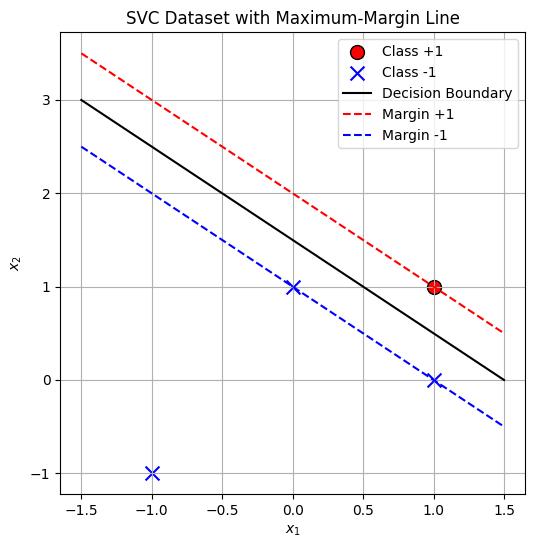

# Q1

Given dataset $\mathcal{D} = \{(\mathbf{x}, v) : ((1, 1), +1), ((-1, -1), -1), ((1, 0), -1), ((0, 1), -1)\}$

## Q1.1

$w_1x_1 + w_2x_2 + b = 0$ where $\mathbf{w} = (w_1, w_2) = (1, 1)$ and $b = 0$.
Thus, $\mathbf{w} = (0.5, 0.5)$.

## Q1.2

The support vectors lies exactly on the margin boundaries, satisfying $v_n(\mathbf{w}^T\mathbf{x}_n + b) = 1$.

For $\mathbf{w} = (0.5, 0.5)$ and $b = 0$:

For $(1, 1)$ with $v_1 = 1$:
$v_1(\mathbf{w}^T\mathbf{x}_1 + b) = 1 \cdot (0.5 \cdot 1 + 0.5 \cdot 1 + 0) = 1$

For $(-1, -1)$ with $v_2 = -1$:
$v_2(\mathbf{w}^T\mathbf{x}_2 + b) = -1 \cdot (0.5 \cdot (-1) + 0.5 \cdot (-1) + 0) = -1 \cdot (-1) = 1$

For $(1, 0)$ with $v_3 = -1$:
$v_3(\mathbf{w}^T\mathbf{x}_3 + b) = -1 \cdot (0.5 \cdot 1 + 0.5 \cdot 0 + 0) = -1 \cdot (0.5) = -0.5 < 1$

For $(0, 1)$ with $v_4 = -1$:
$v_4(\mathbf{w}^T\mathbf{x}_4 + b) = -1 \cdot (0.5 \cdot 0 + 0.5 \cdot 1 + 0) = -1 \cdot (0.5) = -0.5 < 1$

Therefore, the support vectors are:
- $(1, 1)$ with label $+1$
- $(-1, -1)$ with label $-1$

## Q1.3

The SVC optimization problem with bias is:

$$\min_{\mathbf{w},b} \|\mathbf{w}\|^2 \quad \text{subject to} \quad v_n(\mathbf{w}^T\mathbf{x}_n + b) \geq 1 \quad \text{for} \quad n = 1,\ldots,4$$

Using Lagrange multipliers, the dual Lagrangian is:

$$\ell(\mathbf{w}, b, \boldsymbol{\lambda}) = \|\mathbf{w}\|^2 + \sum_{n=1}^{4} \lambda_n (1 - v_n(\mathbf{w}^T\mathbf{x}_n + b))$$

where $\boldsymbol{\lambda} \in \mathbb{R}_+^4$ is the vector of Lagrange multipliers, all non-negative.

## Q1.4

The dual problem is:

$$\max_{\boldsymbol{\lambda} \geq 0} \min_{\mathbf{w},b} \ell(\mathbf{w}, b, \boldsymbol{\lambda})$$

To solve the inner minimization for a fixed $\boldsymbol{\lambda}$, the gradients must be zero:

$$\nabla_{\mathbf{w}}\ell(\mathbf{w}, b, \boldsymbol{\lambda}) = 0$$
$$\frac{\partial \ell}{\partial b}(\mathbf{w}, b, \boldsymbol{\lambda}) = 0$$

Taking the gradient with respect to $\mathbf{w}$:

$$\nabla_{\mathbf{w}}\ell(\mathbf{w}, b, \boldsymbol{\lambda}) = 2\mathbf{w} - \sum_{n=1}^{4} \lambda_n v_n \mathbf{x}_n = 0$$

This gives:

$$\mathbf{w} = \frac{1}{2}\sum_{n=1}^{4} \lambda_n v_n \mathbf{x}_n$$

Taking the derivative with respect to $b$:

$$\frac{\partial \ell}{\partial b}(\mathbf{w}, b, \boldsymbol{\lambda}) = -\sum_{n=1}^{4} \lambda_n v_n = 0$$

## Q1.5

From the second equation:

$$\sum_{n=1}^{4} \lambda_n v_n = 0$$

For this specific dataset, this constraint becomes:

$$\lambda_1 \cdot 1 + \lambda_2 \cdot (-1) + \lambda_3 \cdot (-1) + \lambda_4 \cdot (-1) = 0$$

Simplifying:

$$\lambda_1 - \lambda_2 - \lambda_3 - \lambda_4 = 0$$

Equivalently:

$$\lambda_1 = \lambda_2 + \lambda_3 + \lambda_4$$

## Q1.6

Substituting the optimal $\mathbf{w}$ into the Lagrangian:

$$\ell(\mathbf{w}^*, b, \boldsymbol{\lambda}) = \|\mathbf{w}^*\|^2 + \sum_{n=1}^{4} \lambda_n - \sum_{n=1}^{4} \lambda_n v_n(\mathbf{w}^{*T}\mathbf{x}_n + b)$$

$$= \left\|\frac{1}{2}\sum_{n=1}^{4} \lambda_n v_n \mathbf{x}_n\right\|^2 + \sum_{n=1}^{4} \lambda_n - \sum_{n=1}^{4} \lambda_n v_n\left(\frac{1}{2}\sum_{m=1}^{4} \lambda_m v_m \mathbf{x}_m^T\mathbf{x}_n + b\right)$$

Expanding the first term:

$$\left\|\frac{1}{2}\sum_{n=1}^{4} \lambda_n v_n \mathbf{x}_n\right\|^2 = \frac{1}{4}\left(\sum_{n=1}^{4} \lambda_n v_n \mathbf{x}_n\right)^T\left(\sum_{m=1}^{4} \lambda_m v_m \mathbf{x}_m\right)$$

$$= \frac{1}{4}\sum_{n=1}^{4}\sum_{m=1}^{4} \lambda_n \lambda_m v_n v_m \mathbf{x}_n^T\mathbf{x}_m$$

For the third term:

$$\sum_{n=1}^{4} \lambda_n v_n\left(\frac{1}{2}\sum_{m=1}^{4} \lambda_m v_m \mathbf{x}_m^T\mathbf{x}_n + b\right)$$

$$= \frac{1}{2}\sum_{n=1}^{4}\sum_{m=1}^{4} \lambda_n \lambda_m v_n v_m \mathbf{x}_n^T\mathbf{x}_m + b\sum_{n=1}^{4} \lambda_n v_n$$

Since $\sum_{n=1}^{4} \lambda_n v_n = 0$, the term with $b$ vanishes. The dual function simplifies to:

$$F(\boldsymbol{\lambda}) = \sum_{n=1}^{4} \lambda_n - \frac{1}{4}\sum_{n=1}^{4}\sum_{m=1}^{4} \lambda_n \lambda_m v_n v_m \mathbf{x}_n^T\mathbf{x}_m$$

## Q1.7

Computing inner products for the dataset:

$\mathbf{x}_1^T\mathbf{x}_1 = 1^2 + 1^2 = 2$
$\mathbf{x}_1^T\mathbf{x}_2 = 1 \cdot (-1) + 1 \cdot (-1) = -2$
$\mathbf{x}_1^T\mathbf{x}_3 = 1 \cdot 1 + 1 \cdot 0 = 1$
$\mathbf{x}_1^T\mathbf{x}_4 = 1 \cdot 0 + 1 \cdot 1 = 1$
$\mathbf{x}_2^T\mathbf{x}_2 = (-1)^2 + (-1)^2 = 2$
$\mathbf{x}_2^T\mathbf{x}_3 = (-1) \cdot 1 + (-1) \cdot 0 = -1$
$\mathbf{x}_2^T\mathbf{x}_4 = (-1) \cdot 0 + (-1) \cdot 1 = -1$
$\mathbf{x}_3^T\mathbf{x}_3 = 1^2 + 0^2 = 1$
$\mathbf{x}_3^T\mathbf{x}_4 = 1 \cdot 0 + 0 \cdot 1 = 0$
$\mathbf{x}_4^T\mathbf{x}_4 = 0^2 + 1^2 = 1$

Computing $v_n v_m \mathbf{x}_n^T\mathbf{x}_m$ terms:

$v_1 v_1 \mathbf{x}_1^T\mathbf{x}_1 = 1 \cdot 1 \cdot 2 = 2$
$v_1 v_2 \mathbf{x}_1^T\mathbf{x}_2 = 1 \cdot (-1) \cdot (-2) = 2$
$v_1 v_3 \mathbf{x}_1^T\mathbf{x}_3 = 1 \cdot (-1) \cdot 1 = -1$
$v_1 v_4 \mathbf{x}_1^T\mathbf{x}_4 = 1 \cdot (-1) \cdot 1 = -1$
$v_2 v_2 \mathbf{x}_2^T\mathbf{x}_2 = (-1) \cdot (-1) \cdot 2 = 2$
$v_2 v_3 \mathbf{x}_2^T\mathbf{x}_3 = (-1) \cdot (-1) \cdot (-1) = 1$
$v_2 v_4 \mathbf{x}_2^T\mathbf{x}_4 = (-1) \cdot (-1) \cdot (-1) = 1$
$v_3 v_3 \mathbf{x}_3^T\mathbf{x}_3 = (-1) \cdot (-1) \cdot 1 = 1$
$v_3 v_4 \mathbf{x}_3^T\mathbf{x}_4 = (-1) \cdot (-1) \cdot 0 = 0$
$v_4 v_4 \mathbf{x}_4^T\mathbf{x}_4 = (-1) \cdot (-1) \cdot 1 = 1$

Substituting these values into the dual function and using the constraint $\lambda_1 = \lambda_2 + \lambda_3 + \lambda_4$ with the complementary slackness, the optimal solution is:

$\lambda_1 = \lambda_2 = \frac{1}{2}$ and $\lambda_3 = \lambda_4 = 0$

## Q1.8

The support vectors are the points where $\lambda_n > 0$:
- $(1,1)$ with label $+1$ (corresponding to $\lambda_1 = \frac{1}{2}$)
- $(-1,-1)$ with label $-1$ (corresponding to $\lambda_2 = \frac{1}{2}$)

This is consistent with the earlier analysis in Q1.2.

## Q1.9

Using the formula for $\mathbf{w}$:

$$\mathbf{w} = \frac{1}{2}\sum_{n=1}^{4} \lambda_n v_n \mathbf{x}_n$$

$$\mathbf{w} = \frac{1}{2}(\lambda_1 v_1 \mathbf{x}_1 + \lambda_2 v_2 \mathbf{x}_2 + \lambda_3 v_3 \mathbf{x}_3 + \lambda_4 v_4 \mathbf{x}_4)$$

Substituting the values:

$$\mathbf{w} = \frac{1}{2}\left(\frac{1}{2} \cdot 1 \cdot (1,1) + \frac{1}{2} \cdot (-1) \cdot (-1,-1) + 0 \cdot (-1) \cdot (1,0) + 0 \cdot (-1) \cdot (0,1)\right)$$

$$\mathbf{w} = \frac{1}{2}\left(\frac{1}{2}(1,1) + \frac{1}{2}(1,1)\right) = \frac{1}{2}(1,1) = (0.5, 0.5)$$

For $b$, using the fact that support vectors satisfy $v_n(\mathbf{w}^T\mathbf{x}_n + b) = 1$:

Using support vector $(1,1)$ with label $+1$:
$1 \cdot ((0.5, 0.5) \cdot (1,1) + b) = 1$
$(0.5 + 0.5) + b = 1$
$1 + b = 1$
$b = 0$

Verifying with support vector $(-1,-1)$ with label $-1$:
$(-1) \cdot ((0.5, 0.5) \cdot (-1,-1) + b) = 1$
$(-1) \cdot ((0.5 \cdot (-1) + 0.5 \cdot (-1)) + b) = 1$
$(-1) \cdot (-1 + b) = 1$
$1 - b = 1$
$b = 0$

Therefore, the final solution is:
$\mathbf{w} = (0.5, 0.5)$ and $b = 0$

The equation of the maximum-margin line is:
$0.5x_1 + 0.5x_2 = 0$, which simplifies to $x_1 + x_2 = 0$

This line separates the positive point $(1,1)$ from the negative points $(-1,-1)$, $(1,0)$, and $(0,1)$ with maximum margin perfectly.